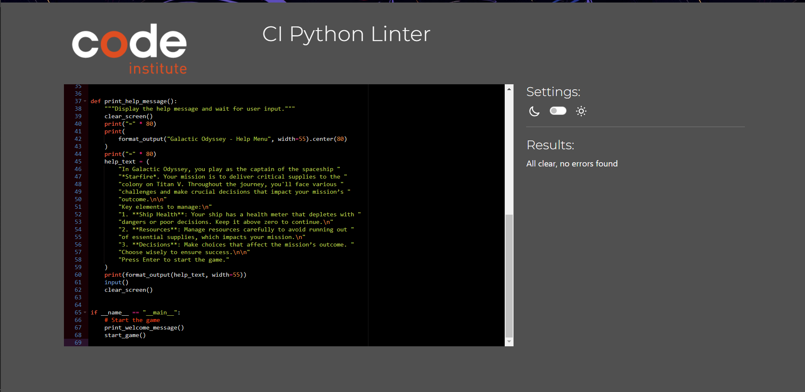

# Galactic Odyssey

## Table of Contents

- [User Experience](#user-experience)
- [Features](#features)
- [Design](#design)
- [Technologies Used](#technologies-used)
- [Testing](#testing)
- [Deployment](#deployment)
- [Credits](#credits)

## User Experience

### User Story
As a user,
- I would like to understand how to interact with the game.
- I would like to be able to make decisions within the game that determine wether I win or fail.
- I would like the options I have to be clearly presented to me.
- I would like to be able to replay the game when I reach an ending by refreshing the terminal.

## Features

### Title Screen
- The game starts with a welcome message.
- Users press Enter to start the adventure or 'h' for help.

### Help Menu
- Provides an overview of game mechanics, including managing ship health and resources.

### Game Flow
- **Intro Story**: Introduction to the mission and preparation for launch.
- **Prepare the Ship**: Address system alerts and prepare the ship for departure.
- **Review Mission**: Review mission parameters and ensure readiness.
- **Equipment Malfunction**: Handle critical equipment failures.
- **Mid-Journey Check**: Respond to space weather conditions.
- **Critical Meltdown**: Decide how to handle a reactor meltdown.
- **Advanced Medical Facility**: Choose whether to integrate advanced medical technology.
- **Alien Encounter**: Choose how to interact with an alien spacecraft.
- **Resource Dilemma**: Manage dwindling resources.
- **Unexpected Visitor**: Decide how to respond to an adrift vessel.
- **Final Challenge**: Navigate through an asteroid field to complete the mission.

### Making Decisions
- Players are prompted to make choices that influence the mission’s outcome.

### Game End
- The game concludes with a summary based on ship health and performance throughout the journey.

## User Interaction

The game is designed to be text-based, guiding the player through various scenarios with choices that impact the game's outcome. Interaction is primarily through input commands that determine the direction of the story. Players make decisions by entering numeric choices corresponding to the available options. The game progresses based on these choices, affecting the player's health, resources, and mission success.

Key interactions include:

- **Initial Choices**: Players start by preparing the ship or reviewing the mission details.
- **Resource Management**: Players manage limited resources to navigate through various challenges.
- **Health Monitoring**: The player's health is influenced by their choices and can affect the game outcome.
- **Story Progression**: Players encounter different scenarios (e.g., equipment malfunction, alien encounters) and make decisions that impact their journey.

## End Screen

The end screen is displayed when the player completes their mission or their health reaches zero. It provides a summary of the player's journey, highlights key achievements or failures, and thanks the player for participating.

The end screen includes:

- **Mission Outcome**: A summary of whether the mission to Titan V was successfully completed or if it ended in failure.
- **Health and Resources Summary**: A recap of the player's final health status and resources.
- **Acknowledgements**: A thank you note to the player for their engagement with the game.
- **Exit Option**: An option to exit the game.

## Future Expansion

Future updates to the game could include:

- **Additional Story Scenarios**: Introducing new scenarios to expand the narrative and provide more variety in gameplay.
- **Enhanced Graphics**: Incorporating graphical elements or animations to complement the text-based storytelling.
- **Sound Effects and Music**: Adding audio elements to enrich the immersive experience.
- **Expanded Choices and Consequences**: Implementing more complex decision-making processes and their impact on the story.
- **Multiplayer Mode**: Exploring options for cooperative or competitive gameplay with other players.

## Design

### Story

The game’s story is central to its design, revolving around the player’s journey as the captain of the spaceship *Starfire*. The narrative unfolds through a series of interconnected scenarios where the player’s choices influence the outcome. The story includes:

- **Introduction**: Sets the stage for the mission and establishes the setting.
- **Challenges**: Various scenarios, such as equipment malfunctions and alien encounters, where players make critical decisions.
- **Resolution**: Concludes with the final challenge and an end screen summarizing the mission's outcome.

### Graphics

The current version of the game is text-based, focusing on narrative and player choice rather than visual elements. Future versions may include:

- **Character and Environment Graphics**: Illustrations of the spaceship, alien encounters, and other elements of the game.
- **User Interface Enhancements**: Improved layouts and visuals for a more engaging experience.

## Technologies Used

- **Python**: The primary programming language used for game development.
- **Textwrap Module**: Utilized for formatting text output to ensure readability and consistency.
- **OS Module**: Employed for clearing the screen and managing system-specific operations.
- **Utils Module**: Contains utility functions such as `format_output` to standardize text formatting across the game.
- **Health Management**: Implemented through a `HealthManager` class to handle player health and related operations.

## Testing

### PEP 8 Testing

To ensure that all Python scripts in this project adhere to the PEP 8 style guide, we performed PEP 8 compliance testing using the **Code Institute Python Linter**, available at [PEP8CI](https://pep8ci.herokuapp.com/#). PEP 8 is the official style guide for Python, and adhering to it helps maintain clean, readable, and consistent code across the project.

The following scripts were tested for PEP 8 compliance:

- **game_logicval.py**
  

- **Healthmanagerval.py**
  

- **runpyval.py**
  

- **storyval.py**
  

- **resourcesval.py**
  

- **utilsval.py**
  

Each of these files was uploaded to the [PEP8CI linter](https://pep8ci.herokuapp.com/#), and the linter's output was reviewed to check for any PEP 8 violations. The linter checks for various coding standards, such as proper indentation, line length, spacing, naming conventions, and more, ensuring that the code follows best practices.

#### Results of PEP 8 Testing

After running all the files through the Code Institute Python Linter, the results were as follows:

- **No PEP 8 Errors or Warnings**: All the files listed above were found to be fully compliant with the PEP 8 guidelines. The linter did not report any errors or warnings, indicating that the code is clean, readable, and follows the standard Python coding style.

#### How to Test PEP 8 Compliance

If you wish to verify PEP 8 compliance for these files or any other files, you can follow these steps:

1. Visit the [PEP8CI linter](https://pep8ci.herokuapp.com/#) website.
2. Upload the Python file(s) you want to test.
3. Review the linter output for any PEP 8 compliance issues.

By ensuring PEP 8 compliance, we maintain a high standard of code quality and readability across the project.


### Lighthouse

Lighthouse is an open-source, automated tool used to improve the quality of web pages. It provides audits for performance, accessibility, best practices, SEO, and Progressive Web Apps (PWAs). To ensure that our project meets high standards across these categories, we used Lighthouse to run a series of tests on our application.

Below is the Lighthouse audit result for our project:


### Explanation of Lighthouse Results

- **Performance**: This metric assesses how quickly the application loads and becomes interactive. Our project achieved a strong performance score, indicating efficient resource use, fast loading times, and minimal render-blocking resources.
  
- **Accessibility**: This score represents how accessible the application is to all users, including those with disabilities. A high score was achieved, reflecting our use of semantic HTML, proper color contrast, alt attributes for images, and keyboard navigation support.

- **Best Practices**: This metric evaluates whether the site adheres to web development best practices, such as using HTTPS, avoiding deprecated APIs, and ensuring that images are optimized. Our project scored highly, showcasing our commitment to modern development standards.

- **SEO**: The SEO score assesses how well-optimized the application is for search engines. A high score indicates that the site follows best practices for content discoverability, such as proper use of meta tags, heading structures, and descriptive link text.

- **Progressive Web App (PWA)**: If applicable, the PWA score evaluates how well the application is set up to work as a Progressive Web App. A high score here reflects our project’s readiness to offer a reliable, installable experience similar to native applications.

### How to Perform a Lighthouse Audit

To perform a Lighthouse audit yourself, follow these steps:

1. Open the project in **Google Chrome**.
2. Right-click on the page and select **Inspect** to open Chrome DevTools.
3. Go to the **Lighthouse** tab in the DevTools panel.
4. Choose the desired categories to audit (Performance, Accessibility, Best Practices, SEO, PWA) and click **Generate Report**.
5. Review the results and adjust the application as needed to improve the scores.

Regular Lighthouse audits help maintain high standards in performance, accessibility, and other key areas, ensuring an excellent user experience across different devices and network conditions.


### Browser Compatibility

The project has been thoroughly tested for compatibility across all major web browsers to ensure a consistent and reliable user experience. The following browsers have been tested:

- **Google Chrome**
- **Mozilla Firefox**
- **Microsoft Edge**
- **Safari**
- **Opera**

The application works smoothly and as expected on all these browsers, maintaining the same functionality, layout, and performance. This cross-browser compatibility ensures that users can access and use the application seamlessly, regardless of their preferred browser choice.

By supporting multiple browsers, we aim to provide a high-quality experience for a wide range of users, ensuring that no one is left out due to browser limitations.


### Testing Functionality

The terminal application has been thoroughly tested and played through multiple times to ensure all features function correctly and provide a smooth user experience. The testing process involved going through each possible user interaction to check for any bugs, errors, or unexpected behavior.

Key aspects tested include:

- **User Inputs**: All possible user inputs were tested, including valid and invalid entries, to ensure the application handles them correctly and provides appropriate feedback.
- **Flow of the Application**: The app was played through from start to finish to verify that the logic flows as expected and that users can progress without encountering errors.
- **Error Handling**: Various scenarios were simulated to test the app's ability to handle exceptions gracefully, such as incorrect inputs or edge cases.
- **General Stability**: The app was tested for stability across different environments and terminals to confirm consistent performance.

Overall, the testing confirmed that the terminal app is stable, bug-free, and performs as intended across various scenarios.


### Testing User Stories

The following user stories were identified during the planning phase of the project. Each story was tested to ensure that the application meets the user's requirements and provides a seamless experience.

#### User Story 1: "As a user, I want to be able to start a new game easily."

- **Testing**: Verified that the application starts a new game with a clear command or option available to the user. Tested multiple times to ensure the game initializes correctly each time without any errors.

#### User Story 2: "As a user, I want to see clear instructions on how to play the game."

- **Testing**: Checked that the game provides clear and concise instructions at the start or through an accessible command. Verified that instructions are easily understandable and provide all necessary details for gameplay.

#### User Story 3: "As a user, I want to input my choices and receive immediate feedback."

- **Testing**: Tested all input options to ensure they are accepted by the application and that feedback is given promptly. This included testing both valid and invalid inputs to confirm appropriate handling and feedback.

#### User Story 4: "As a user, I want to be able to view my score or progress at any point."

- **Testing**: Ensured that users can view their score or progress at any point during the game by following the provided instructions or commands. Tested different stages of the game to verify accurate display of scores or progress.

#### User Story 5: "As a user, I want to be able to replay the game."

- **Testing**: Verified that the game can be replayed by refreshing the browser or terminal. Tested multiple times to ensure that refreshing correctly resets the game state and allows for a new game session without any issues.

#### User Story 6: "As a user, I want a smooth and bug-free experience throughout the game."

- **Testing**: Played through the game multiple times from start to finish, simulating various scenarios to ensure there were no crashes, bugs, or unexpected behaviors. Verified that the game provides a consistent experience across all tests.

Overall, each user story was thoroughly tested to confirm that the application meets the user's needs and performs reliably under various conditions.


## Deployment

## How to Deploy Your App on Heroku

1. **Start a New App**
   - In your Heroku dashboard, click on "New" and select "Create new app".
   - Provide a unique name for your application.
   - Choose the appropriate region for your deployment.
   - Click "Create app" to initialize your new app.

2. **Configure Environment Variables**
   - Go to the "Settings" tab of your app.
   - Find the "Config Vars" section and click "Reveal Config Vars".
   - Add the necessary configuration variables. For instance, set `PORT` as the key and `8000` as the value.
   - Click "Add" to save your settings.

3. **Set Up Buildpacks**
   - In the "Settings" tab, locate the "Buildpacks" section and click "Add buildpack".
   - Add the "python" buildpack first, then click "Save changes".
   - Add the "node.js" buildpack next and click "Save changes" again.

4. **Deploy Your Application**
   - Navigate to the "Deploy" tab.
   - Choose "GitHub" as your deployment method and connect your GitHub account if needed.
   - Search for your repository and click "Connect" to link it with Heroku.
   - In the "Deploy" section, you can choose between:
     - **Automatic Deploys**: Enable this option to automatically deploy your app whenever you push updates to GitHub.
     - **Manual Deploy**: Select the branch you want to deploy and click "Deploy Branch" to start the deployment process manually.

5. **Access Your App**
   - Monitor the build and deployment progress on the Heroku dashboard.
   - Once the deployment is complete, you can view your app by clicking "Open app" at the top of the page.

### Steps to Clone Site

1. **Clone the Repository**: To clone the repository to your local machine, use the Git clone command. Replace `REPOSITORY_URL` with the URL of the repository:
    ```bash
    git clone REPOSITORY_URL
    ```

2. **Navigate to the Project Directory**: Change to the directory where the project was cloned:
    ```bash
    cd PROJECT_DIRECTORY
    ```

3. **Set Up Your Environment**: If the project requires any environment variables or dependencies, set them up according to the project's documentation. For a Python project, you might need to install dependencies:
    ```bash
    pip install -r requirements.txt
    ```

4. **Run the Application Locally**: Start the application locally to ensure it works as expected:
    ```bash
    python run.py
    ```

5. **Update Remote Settings**: If you plan to push changes back to the original repository, ensure your Git remote settings are correct:
    ```bash
    git remote -v
    ```

6. **Push Changes**: To push any local changes to the repository, commit them first and then push:
    ```bash
    git add .
    git commit -m "Your message"
    git push origin master
    ```

## Credits

This project was made possible with the help and inspiration from various resources, repositories, and documentation. Below is a list of credits to acknowledge their contributions:

#### GitHub Repositories

- **Hangman Game by mittnamnkenny**: This repository provided inspiration for some game logic and structuring ideas. [GitHub Link](https://github.com/mittnamnkenny/hangman-game/tree/main)
- **SEO Tools by Jannis Kiriasis**: Utilized some ideas for optimizing game code and structuring functions effectively. [GitHub Link](https://github.com/jannis-kiriasis/seo-tools)
- **Hide and Seek by SJECollins**: Inspiration for terminal-based game design and user interaction patterns. [GitHub Link](https://github.com/SJECollins/ci-pp3-hide-and-seek)
- **The Hobbit Game by charlie-vf**: Influences for game mechanics and user input handling. [GitHub Link](https://github.com/charlie-vf/the-hobbit-game)

#### Documentation and Modules

- **Python `sys` Module**: Used to handle system-level operations and exit the game cleanly. Documentation available [here](https://docs.python.org/3/library/sys.html).
- **Python `os` Module**: Employed for handling terminal clear commands and other operating system interactions. Documentation available [here](https://docs.python.org/3/library/os.html).
- **Python `textwrap` Module**: Used to format text output to fit within a specific width, ensuring better readability in the terminal. Documentation available [here](https://docs.python.org/3/library/textwrap.html).

#### Additional Acknowledgments

- **Code Institute Python Linter**: Used for ensuring PEP 8 compliance throughout the project. More information can be found [here](https://pep8ci.herokuapp.com/#).
- **Lighthouse Tool**: Utilized for checking performance, accessibility, SEO, and best practices for the web-based aspects. More information is available in the Chrome DevTools documentation [here](https://developers.google.com/web/tools/lighthouse).
- **Stack Overflow and Python Community**: Various discussions and answers were referenced to solve specific coding challenges and improve the overall quality of the code.

Special thanks to all the developers, communities, and documentation that made this project possible!

## Acknowledgements
I would like to express my sincere gratitude to my mentor, **Brian Macharia**, for his guidance and encouragement throughout this project.